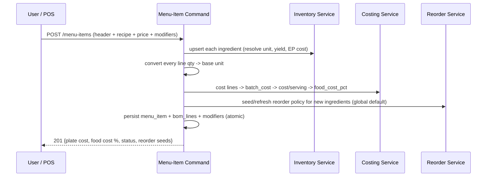

# Menu-Item & Inventory CRUD — Design Guide

**Recipe-driven costing, automatic BOM, reorder automation, and modifiers**

This guide describes how to evolve the existing inventory CRUD so that a user can define a
menu item, its recipe, ingredient quantities and final selling price in a single submission,
and have the backend derive everything else: the bill of materials (BOM), per-plate cost,
food-cost %, and inventory reorder levels / reorder quantities. It also covers attaching
modifiers (inline or later) and the plain path for non-recipe goods, services and equipment.

It is written to sit on top of a typical POS/inventory schema (the kind used by SimbaPOS,
JiPOS, iOSoft and similar Kenyan systems): a raw-ingredient inventory layer, a recipe/BOM
layer that maps each menu item to ingredient quantities, and automatic stock deduction on
sale.

---

## 1. The gap we are closing

Most existing CRUD screens treat every sellable thing and every stock thing as the *same*
flat "inventory item", and ask the user to wire BOM lines, costs and reorder thresholds by
hand afterwards. That is error-prone and means cost and reorder data drift out of sync the
moment a recipe changes.

The target behaviour:

1. **One submission defines the whole menu item** — header, recipe source, ingredient lines
   (with their own units), and the final price the user wants to charge.
2. **The backend computes the rest** — it upserts the ingredients into inventory, builds the
   BOM, costs each line, rolls up the plate cost and food-cost %, and seeds reorder levels and
   reorder quantities (using global unit-based defaults until real consumption data exists).
3. **Modifiers are first-class** — definable with the menu item or later, linked to any number
   of items, and when linked or edited the backend recalculates their effect on both quantity
   (stock draw) and price (final line price and food cost).
4. **Plain goods, services and equipment keep the simple path** — they are just inventory items
   with no recipe and no BOM.

---

## 2. Domain model

Keep one `inventory_item` table as the source of truth for anything that has stock or a cost,
and discriminate by `item_type`. Sellable things are `menu_item`s that *reference* inventory
items through a recipe. This avoids the "everything is one flat row" trap while still letting
reorder logic run uniformly over anything stock-tracked.

```
inventory_item
  id
  name
  item_type            -- RAW_INGREDIENT | RESALE_GOOD | PACKAGING | SERVICE | EQUIPMENT
  base_unit            -- canonical unit for stock & costing: g | ml | pc | ...
  purchase_unit        -- how it is bought: kg | litre | crate | dozen | pc ...
  purchase_pack_size   -- base units per purchase unit (e.g. 1 kg = 1000 g)
  purchase_price       -- price per purchase_unit (KSh)
  yield_pct            -- usable fraction after trim/loss, 0 < y <= 1 (default 1.0)
  is_stock_tracked     -- services are usually false
  reorder_policy_id    -- nullable; resolved from global defaults when null
  on_hand_qty          -- in base_unit

menu_item
  id
  code                 -- e.g. BEE006
  name
  category             -- Main Dishes | Pizza | Burger | ...
  recipe_source        -- free text: "Manual #1", "Constructed", etc.
  servings             -- batch yield (portions a recipe produces)
  selling_price        -- the user-entered final price (an INPUT, never overwritten)
  is_recipe_based      -- true => has BOM; false => plain resale good
  -- computed & cached:
  batch_cost, cost_per_serving, food_cost_pct, gross_profit, status

bom_line                       -- one row per ingredient in a recipe
  id
  menu_item_id
  inventory_item_id            -- the ingredient
  qty                          -- as the user typed it
  qty_unit                     -- the unit the user typed (tsp, clove, g, slice…)
  qty_base                     -- normalised to ingredient.base_unit (computed)
  line_cost                    -- qty_base * ep_unit_cost (computed)

modifier
  id
  name                         -- "Extra Cheese", "Add Bacon", "No Onion"
  price_adjustment             -- signed KSh added to the line price (may be negative/0)
  modifier_cost                -- Σ of its mini-BOM line costs (computed)
  modifier_fc_pct              -- modifier_cost / price_adjustment (computed, when adj > 0)

modifier_line                  -- the modifier's own mini-BOM (same shape as bom_line)
  id, modifier_id, inventory_item_id, qty, qty_unit, qty_base, line_cost
  sign                         -- +1 adds stock draw, -1 removes a parent line ("no cheese")

menu_item_modifier             -- link table (many-to-many)
  menu_item_id, modifier_id, is_default

reorder_policy
  id
  scope                        -- ITEM | CATEGORY | UNIT (global default)
  scope_key                    -- item id / category name / base unit
  reorder_level                -- ROP, in base_unit
  reorder_qty                  -- how much to order back, in base_unit
  lead_time_days, safety_days, review_period_days
  source                       -- DEFAULT | COMPUTED | MANUAL_OVERRIDE
```

The key relationships: a `menu_item` has many `bom_line`s, each pointing at an
`inventory_item`. A `modifier` has its own `modifier_line`s and is attached to menu items via
`menu_item_modifier`. Reorder behaviour for any stock-tracked `inventory_item` is resolved
from a `reorder_policy`, falling back to a global unit default.

---

## 3. Unit-of-measure layer (do this first)

Everything downstream depends on being able to convert "1 tsp", "1 clove", "180 g" into the
ingredient's `base_unit`. Build a small conversion service and call it on every BOM/modifier
line at write time, caching the result in `qty_base`.

```
to_base(qty, qty_unit, ingredient):
    if qty_unit == ingredient.base_unit: return qty
    # standard conversions
    if (qty_unit, ingredient.base_unit) in STD_TABLE:        # tsp->ml=5, tbsp->ml=15, cup->ml=240, kg->g=1000…
        return qty * STD_TABLE[(qty_unit, ingredient.base_unit)]
    # ingredient-specific conversions (countable -> mass/volume)
    if qty_unit in ingredient.custom_conversions:            # clove->g=3, slice->g=20, egg->pc=1…
        return qty * ingredient.custom_conversions[qty_unit]
    raise UnitConversionError(qty_unit, ingredient)          # reject the submission, don't guess
```

Reject unknown conversions loudly rather than silently assuming — a wrong conversion corrupts
both cost and stock deduction.

---

## 4. Global default reorder levels & quantities

Until an ingredient has real sales history, you cannot compute a demand-based reorder point.
Provide **global, unit-based defaults** so a freshly auto-created ingredient still gets a sane
threshold the moment it is added. Store these as `reorder_policy` rows with `scope = UNIT`.

| Base unit | Default reorder level (ROP) | Default reorder qty | Default lead time |
|-----------|-----------------------------|---------------------|-------------------|
| g         | 2 000 g                     | 10 000 g            | 3 days            |
| ml        | 2 000 ml                    | 10 000 ml           | 3 days            |
| pc        | 20 pc                       | 100 pc              | 3 days            |
| kg        | 2 kg                        | 10 kg               | 3 days            |
| litre     | 2 l                         | 10 l                | 3 days            |

Resolution order when an ingredient needs a policy (first match wins):

```
item-level override  ->  category default  ->  unit (global) default  ->  hard fallback
```

These are *starting* values. Once consumption data accrues, a scheduled job upgrades the
policy `source` from `DEFAULT` to `COMPUTED` (Section 6.3). A user can always pin an
item-level `MANUAL_OVERRIDE`, which never gets overwritten.

---

## 5. The composite "Define Menu Item" submission

The core change is making **menu-item creation a single transactional command** that carries
the recipe and price, instead of several disconnected CRUD calls.

### 5.1 Request payload

```jsonc
POST /api/menu-items
Idempotency-Key: <uuid>
{
  "code": "BEE006",
  "name": "Beef Grilled (200g)",
  "category": "Main Dishes",
  "recipe_source": "Manual #1",
  "servings": 1,
  "selling_price": 900,
  "recipe": [
    { "ingredient": "Beef steak (sirloin/rump)", "qty": 200, "unit": "g",
      "purchase_price": 750, "purchase_unit": "kg", "yield_pct": 0.80 },
    { "ingredient": "Cooking oil", "qty": 1, "unit": "tsp" },
    { "ingredient": "Garlic", "qty": 1, "unit": "clove" },
    { "ingredient": "Accompaniment (1 of choice)", "qty": 1, "unit": "pc" }
  ],
  "modifiers": [                       // optional — may be omitted and linked later
    { "name": "Extra Cheese", "price_adjustment": 200,
      "lines": [ { "ingredient": "Cheese slice (cheddar)", "qty": 40, "unit": "g" } ] }
  ]
}
```

Ingredient lines carry purchase metadata only when the ingredient is *new*. If it already
exists in inventory, the backend matches by name/id and ignores the purchase fields (or treats
a change as a price update — your policy).

### 5.2 Backend pipeline (one transaction)



Step by step:

1. **Validate & resolve units.** Run `to_base` on every recipe and modifier line. Any
   unresolved unit aborts the whole transaction with a 422 — nothing is half-written.
2. **Upsert ingredients.** For each line, find or create the `inventory_item`. On create,
   compute its edible-portion unit cost:

   ```
   purchase_unit_cost = purchase_price / purchase_pack_size      # KSh per base unit
   ep_unit_cost       = purchase_unit_cost / yield_pct           # cost of a usable base unit
   ```

3. **Cost the BOM.** (Formulas in 6.1.) Cache `line_cost`, `batch_cost`, `cost_per_serving`,
   `food_cost_pct`, `gross_profit`, and a `status` flag.
4. **Guard the price.** `selling_price` is an input and is never overwritten. If
   `food_cost_pct` exceeds the target (e.g. 35%), persist anyway but return
   `status = "above target FC%"` so the UI can warn. Only reject if cost ≥ price (a true loss),
   and even then prefer a warning unless policy says otherwise.
5. **Seed reorder policy.** For every newly created ingredient with no policy, attach the
   global unit default (Section 4). Existing ingredients keep theirs.
6. **Persist atomically.** Menu item, BOM lines, any inline modifiers, and links all commit
   together or not at all. Use the `Idempotency-Key` so a retried submission does not double-
   create.
7. **Emit `RecipeChanged`.** A domain event that the reorder recompute job (6.3) and any cache
   subscribers listen to.

### 5.3 Editing (`PATCH /api/menu-items/{id}`)

Same pipeline, but a diff: re-cost from scratch, re-run the price guard, and re-emit
`RecipeChanged` so reorder levels for affected ingredients are recomputed. Editing the price
alone only re-runs the cost-vs-price guard (cost is unchanged).

---

## 6. The computations

### 6.1 Cost roll-up

```
line_cost        = qty_base * ep_unit_cost
batch_cost       = Σ line_cost
cost_per_serving = batch_cost / servings
food_cost_pct    = cost_per_serving / selling_price
gross_profit     = selling_price - cost_per_serving
status           = "OK - healthy"          if food_cost_pct <= target
                   "OK - above target FC%"  if target < food_cost_pct < 1
                   "LOSS - cost >= price"   if food_cost_pct >= 1
```

`target` is configurable (industry norm 28–35%).

### 6.2 Reorder seeds (no history yet)

Pull `reorder_level`, `reorder_qty`, `lead_time_days` straight from the resolved policy
(item → category → unit default). Mark `source = DEFAULT`.

### 6.3 Reorder recompute (once consumption exists)

A scheduled job (nightly) turns sales into demand per ingredient and upgrades the policy. Each
sale of a menu item — including any selected modifiers — deducts the BOM and modifier mini-BOM
from stock; aggregate that to get usage:

```
daily_usage(ingredient) = Σ over menu_items [ forecast_daily_sales(item) * bom_qty_base(item, ingredient) ]
                        + Σ over modifiers  [ forecast_daily_sales(modifier) * mod_qty_base(modifier, ingredient) ]

reorder_level (ROP) = daily_usage * lead_time_days + safety_stock
safety_stock        = daily_usage * safety_days            # simple; or z * σ * √lead_time if you track variance
par_level           = daily_usage * (lead_time_days + review_period_days) + safety_stock
reorder_qty         = par_level - reorder_level            # top-up to par
                      # or EOQ = √(2 * annual_demand * order_cost / holding_cost) if you prefer
```

Write these back with `source = COMPUTED`, but **never** overwrite a `MANUAL_OVERRIDE`. If
`daily_usage` is still zero (item not selling yet), leave the global `DEFAULT` in place.

The important consequence: because modifier sales feed `daily_usage`, attaching a popular
modifier to an item automatically raises projected demand for that modifier's ingredients,
which raises their reorder level on the next recompute. Reorder data stays coupled to what is
actually being sold.

---

## 7. Modifiers and variants

### 7.1 Defining and linking

A modifier is a tiny recipe plus a signed price adjustment. It can be created inside the
menu-item payload (Section 5.1) or on its own and linked afterwards:

```
POST /api/modifiers                         -> create a reusable modifier
POST /api/menu-items/{id}/modifiers         -> link existing modifier(s) to an item
DELETE /api/menu-items/{id}/modifiers/{mid} -> unlink
PATCH /api/modifiers/{id}                    -> edit cost/qty/price; triggers recompute
```

On create or edit, recompute the modifier's own figures:

```
modifier_cost   = Σ modifier_line.line_cost
modifier_fc_pct = modifier_cost / price_adjustment     # only when price_adjustment > 0
```

### 7.2 Effect on quantity and price

When a modifier is **linked** to a menu item (or edited while linked), emit `ModifierLinked`
/ `ModifierChanged` and recalculate two things:

**Price effect** — the modifier does not change the base item's stored price; it adds to the
*line* price at point of sale:

```
effective_line_price = base_selling_price + Σ selected modifier.price_adjustment
effective_line_cost  = base_cost_per_serving + Σ selected modifier.modifier_cost
effective_food_cost  = effective_line_cost / effective_line_price
```

**Quantity (stock) effect** — a sale with the modifier draws the parent BOM *plus* the
modifier's mini-BOM. Positive lines (`sign = +1`) add a stock draw; negative lines
(`sign = -1`, e.g. "no cheese") remove the corresponding parent line and may carry a zero or
negative `price_adjustment`. This modifier-driven draw flows into `daily_usage` (6.3), so the
reorder levels of the modifier's ingredients update on the next recompute.

### 7.3 Worked example (matches the costing model)

```
Beef Burger base (BUR001) cost/serving      = 196.11
+ "Extra Cheese" modifier (40 g cheddar)    = +40.00  cost,  +400 price → sold as BUR006 @ 1050
effective_line_cost  = 196.11 + 40.00       = 236.11
effective_line_price = 650 + 400            = 1050
effective_food_cost  = 236.11 / 1050        = 22.5%
```

Adding the modifier raises cost by KSh 40 but price by KSh 400, so the cheese variant runs a
*healthier* food-cost % than the plain burger — and the 40 g of cheddar per sale now counts
toward the cheese ingredient's projected usage and reorder level.

### 7.4 Size variants

Treat each size (S/M/L) as its own sellable SKU whose recipe is the master (Large) recipe
scaled by an area factor, so the smaller sizes deduct proportionally less stock:

```
qty_base(size) = qty_base(Large) * area_factor(size)     # S≈0.5625, M≈0.7639, L=1.0
```

Price is set per size (a user input per SKU); cost scales with the BOM. Model variants either
as separate `menu_item` rows sharing a recipe template, or as a `variant` modifier that
multiplies quantities — pick one and be consistent.

---

## 8. Plain goods, services and equipment

These need none of the recipe machinery. Route them through the ordinary inventory create with
`is_recipe_based = false` and no BOM:

- **Resale goods** (bottled drinks, wines, honey, mug): `item_type = RESALE_GOOD`, priced by
  `purchase_cost + margin`; reorder via global unit default or a manual override. They are sold
  directly and deduct one unit of themselves per sale.
- **Services** (conference, co-working, plating): `item_type = SERVICE`,
  `is_stock_tracked = false`; no reorder policy.
- **Equipment** (assets, not consumed per sale): `item_type = EQUIPMENT`,
  `is_stock_tracked = false` (or tracked as fixed assets, not reorder-managed).

The same `POST /api/inventory-items` endpoint handles all three — no recipe, no cost roll-up,
no BOM emitted.

---

## 9. Recalculation triggers

Keep cached cost/reorder figures correct by recomputing on events rather than on every read:

| Event | Recompute |
|-------|-----------|
| `RecipeChanged` (create/edit menu item) | that item's cost roll-up; reorder seeds for new ingredients |
| `IngredientPriceChanged` | EP cost, then every BOM/modifier line using it, then affected items' costs |
| `ModifierLinked` / `ModifierChanged` | modifier figures; effective price/cost/FC for linked items |
| `SalesPosted` (nightly) | `daily_usage`, then `COMPUTED` reorder levels & quantities |
| `ReorderPolicyOverridden` | pin item-level policy; exclude from future `COMPUTED` overwrites |

---

## 10. API surface (summary)

```
POST   /api/menu-items                       composite create (header + recipe + price + modifiers)
PATCH  /api/menu-items/{id}                   edit; re-costs and re-seeds
GET    /api/menu-items/{id}                   item + BOM + cached cost/FC + linked modifiers
POST   /api/modifiers                         create reusable modifier
PATCH  /api/modifiers/{id}                    edit; triggers recompute on all linked items
POST   /api/menu-items/{id}/modifiers         link modifier(s)
DELETE /api/menu-items/{id}/modifiers/{mid}   unlink
POST   /api/inventory-items                   plain goods / services / equipment
GET    /api/inventory-items/{id}/reorder      resolved policy + on-hand + suggested order qty
```

All write endpoints accept an `Idempotency-Key` and run inside a single transaction.

---

## 11. Implementation checklist

1. Add `item_type`, `base_unit`, `purchase_pack_size`, `yield_pct`, `reorder_policy_id` to the
   inventory table; add the `menu_item`, `bom_line`, `modifier`, `modifier_line`,
   `menu_item_modifier`, `reorder_policy` tables.
2. Build the unit-conversion service with a standard table plus per-ingredient custom
   conversions; make it reject unknowns.
3. Seed the global unit-based reorder defaults (Section 4).
4. Implement the composite menu-item command with the seven-step transactional pipeline.
5. Implement the costing service (6.1) and cache results on `menu_item`.
6. Implement reorder seeding (6.2) and the nightly recompute job (6.3) with the
   `DEFAULT → COMPUTED`, never-overwrite-`MANUAL_OVERRIDE` rule.
7. Implement modifier create/link/edit with price + quantity recalculation (Section 7).
8. Keep the plain inventory path untouched for goods/services/equipment (Section 8).
9. Wire the recalculation events (Section 9).

Phasing suggestion: ship 1–5 first (define an item, get its cost and a default reorder level),
then 6–7 (demand-based reorder and modifiers), then 9 (event-driven consistency).
